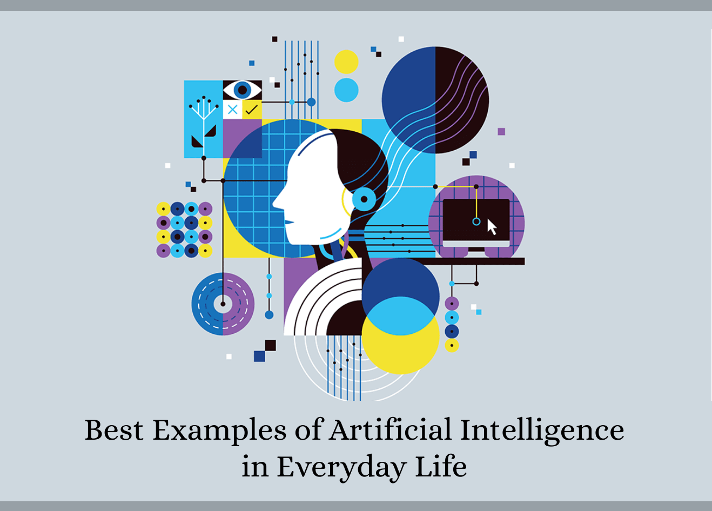

## Is artificial intelligence going to replace developers??

Artificial intelligence is a revolutionary tool in this modern era. I believe that it has brought numerous benefits to my education and added an extra dimension to my research. AI can provide answers to questions at lightning speed, and the most amazing part is that, in most cases, the information provided is accurate. However, everything is not always perfect, and artificial intelligence is no exception. In this essay, I will share my experience with AI in my class, highlighting the unique and surprising aspects, as well as the challenges that made my life harder.

Why not ask an expert? Let's give the mic to ChatGPT.

[ChatGPT Question 1](https://chat.openai.com/share/2a67d803-0967-4b8b-89a9-dd448eb87cd1)
Explain how ChatGPT can be useful for learning functional programming and what to be careful of when using it for this.

```
ChatGPT can be a helpful resource for learning functional programming in several ways:

1. **Conceptual Explanations:** You can ask ChatGPT to explain fundamental concepts of functional programming, such as immutability, higher-order functions, pure functions, and lambda expressions. It can provide clear and concise explanations to help you understand these concepts better.

2. **Code Examples:** ChatGPT can generate functional programming code snippets based on your requests. This can be particularly useful for understanding how to implement certain features or concepts in a functional programming paradigm. You can ask for examples in languages like Haskell, Scala, or Lisp, which are known for their functional programming support.

```
   ... full answer check the link here [ChatGPT Question 1](https://chat.openai.com/share/2a67d803-0967-4b8b-89a9-dd448eb87cd1)

After experiencing an amazing response from ChatGPT, I will deep into my personal experience and use of ChatGPT in the course of operating system ICS 314. I will discuss the pros and cons of using ChatGPT in this course. There were a number of experiences or assignments we were asked to do in order to achieve this.
 delve 

1. Experience WODs e.g. E18
2. In-class Practice WODs
3. In-class WODs
4. Essays
5. Final project
6. Learning a concept / tutorial
7. Answering a question in class or in Discord
8. Asking or answering a smart-question
9. Coding example e.g. “give an example of using Underscore .pluck”
10. Explaining code
11. Writing code
12. Documenting code
13. Quality assurance 
14. Other uses in ICS 314 not listed

To begin with, let me explain what a WOD is. In general, it is a timed quiz that serves as a preparation for a job interview, creating an environment that closely mimics a real interview, complete with a time limit to code. During this experience, I did not utilize Artificial Intelligence extensively, mainly because I did not have enough time to come up with the perfect prompts to ask ChatGPT. As an overthinker, I decided to dive right in and start working as quickly as possible so that I could have time to figure things out on my own without relying on ChatGPT and potentially receiving incorrect or unfamiliar answers. 

furthermore, when I first used ChatGPT for WODs, the information it gave me was often too advanced, making simple exercises hard to understand.

- **ESSAY**
I have found AI a really helpful tool to improve my grammar and make sure that I have an adequate document. Since English is not my native language, I have found that AI is a great tool for learning from mistakes that usually nobody will tell; I like having AI checking for my grammar and making sure everything makes sense in the way I want it, even I ask chatGPT if they could answer that questions just to check my questions are understandable.

Writing essays can be fun because it allows me to express my own ideas and I can let my thoughts flow. Sometimes, I worry about formatting and structure, but there are moments when all my ideas rush to my head like a huge wave, and I just need to write them down as fast as I can before I lose my inspiration.

When I first start writing, my grammar is often incorrect and I tend to make a lot of spelling errors. However, with just a few clicks, those errors can be corrected and the only thing I need to worry about is proofreading my essay to ensure that I am happy with what I have written.

- **FINAL PROJECT**
  So far in my project, we haven't experienced AI because all the necessary information is found in the screencast that this course provided.

- **LEARNING A CONCEPT / TUTORIAL**
I have used AI to learn concepts and while I haven't needed much explanation for this particular course in ICS, I have found the information provided by Chat GPT to be really useful. It aligns with what I have learned in class and sometimes even offers better explanations than what I can find in books or from my own professors.

- **ANSWERING A QUESTION IN CLASS OR IN DISCORD**
The teacher in this class encourages the use of ChatGPT for all questions to see what it comes up with, usually Chat GPT will provided some what of good information when it goes reagrding terminology.

- **CODING WITH CHAT GPT**
This was kind of challenging because something that got will take you down an unknown path to solve some issues.
 example e.g. “give an example of using Underscore .pluck”
- **EXPLAINIG CODE**
I was surprised at how simple AI can guide you through code. I found it helpful in some cases, especially when the code gets bigger and more difficult to understand. Having AI break through and analyze your code in case you may be doing something wrong is a great way to maintain a good understanding of your code.

11. Writing code
12. Documenting code
13. Quality assurance 
## III. IMPACT ON LEARNING AND UNDERSTANDING
I have found that AI is very helpful in quickly clearing up any concepts that can be confusing, such as the management of databases. AI can provide a clear definition of what databases are and if you delve deeper into this topic, it can even give examples and illustrations, including small snippets of code that demonstrate how databases work.
## IV. PRACTICAL APPLLICATION
  There are many different ways that AI can be of practical use in a range of industries. For example, it can help with automation, making it easier for humans to focus on creative tasks and leaving the mundane work to machines. It can also be used for data analysis, helping people to make better decisions based on large sets of information.

Another way that AI is useful is in creating personalized experiences for users. This can be done using natural language processing (NLP), which allows machines to understand and respond to human language. Additionally, AI can be used to recognize images and speech, which can be helpful in a variety of contexts.

In healthcare, AI is often used to help with medical image analysis, drug discovery, and personalized medicine. It can also be useful in the development of autonomous vehicles, where it can help the vehicle to make decisions in real-time based on its surroundings.

Other industries where AI is becoming increasingly important include cybersecurity, supply chain management, education, and finance. However, it is important to consider the ethical implications, privacy concerns, and biases associated with these applications of AI.

Overall, AI has the potential to be a valuable tool in many different industries, but it is important to approach its use with care and consideration. By doing so, we can ensure that it is used in a way that is helpful, fair, and safe for everyone involved.
## V. CHALLENGES AND OPPORTUNITIES
## VI. COMPARATIVE ANALYSIS
## VII FUTURE CONSIDERATION
## VIII CONCLUSION


 

