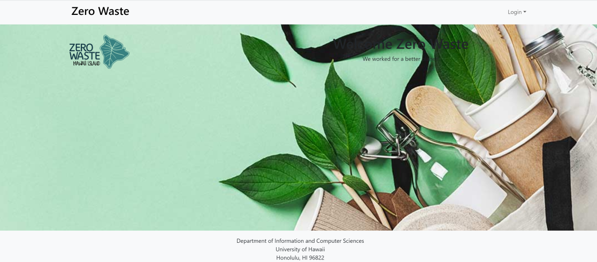

## What is Zero Waste?
A non-profit organization operating a reusable takeout container program to replace single-use plates at events has been experiencing significant losses, with 20-30% of containers needing to be added. A system was developed to hold customers accountable for returning the company's reusable containers to counter this issue. The Zero-Waste app tracks these containers and maintains a database to ensure efficient management and return tracking.

### Features

To get started, there are two ways to access the logging system. You can use vendor credentials to log in. Once the vendor has successfully logged in, a dashboard will display with vital information regarding container distribution and inventory. For the vendor manager, we have two pages - the first is for adding containers, where the vendor can add as many containers to the inventory as needed. The second is a tracking page which will list the number of orders made by users, providing us with a unique number called an order ID number. This helps us recognize the details of each order, including the number and type of containers borrowed by each user. Using this method, we will be able to provide the appropriate refunds.

## Milestones
The progress in achieving Zero Waste goals was organized through an issue-focused strategy, managing developments by categorizing them into distinct milestones, each functioning as its own project.

#### M1
In Milestone 1, our main aim was to establish the fundamental functionalities crucial for page creation. My primary task was to create mockups using presentation tools like PowerPoint, illustrating the project's challenges and our proposed solutions through visuals and ideas.
#### M2

During Milestone 2, our focus shifted to assembling the pages using the components developed in Milestone 1. My primary responsibility was to translate the mockups into functional web pages, specifically creating user pages and updating the organization's website with live screenshots from the developed pages.

#### M3
In Milestone 3, our main efforts were directed towards finalizing the payment page and conducting thorough testing to ensure the proper functionality of the QR code.
