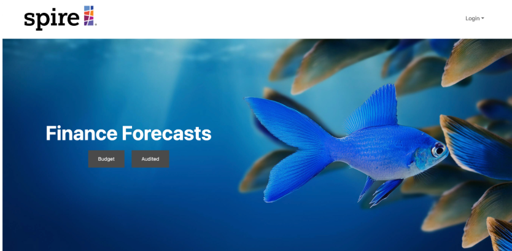

## What is Zero Waste?
Please see our site at [Mixed-plate WEBSITE](https://mixed-plate.github.io/).

Developed a user-friendly financial planning platform that allows clients to securely input financial data, which is then processed using proprietary algorithms to generate personalized insights and visualizations. Implemented role-based access, financial data forms, dashboards, and a streamlined user experience.

### Features

Key features include secure financial data entry, role-based access control, interactive dashboard visualizations, administrative management tools, CSV-based data import, a fully responsive Next.js interface, and continuous integration through GitHub Actions.

## Milestones
The progress in achieving mixed-plate goals was organized through an issue-focused strategy, managing developments by categorizing them into distinct milestones, each functioning as its own project.

#### M1 Initial Set up

focused on establishing the foundation of the project. The team created a full team contract, defined roles, and aligned responsibilities. We also set up the project using the Next.js template and created the initial UI for the landing page, sign-in page, input page, and dashboard.

#### M2 First customer deliverable

This milestone was primarily about preparing a functional workflow for financial data entry and ensuring the project met early customer expectations.

#### M3 Forms Mockup & Continuous Integration
Milestone 3 focused on refining the forms used for budget and audited data. We removed placeholder values, added missing items to the audited balance sheet, and created mock-up versions for the redesigned forms.
#### M4 Role Enhancements & UI Improvements

In Milestone 4, the team added more user roles and connected functionalities to those roles. We made major improvements to the audited balance sheet by adding total calculations and redesigned the form UI to more closely match the original spreadsheet format.
#### M5
